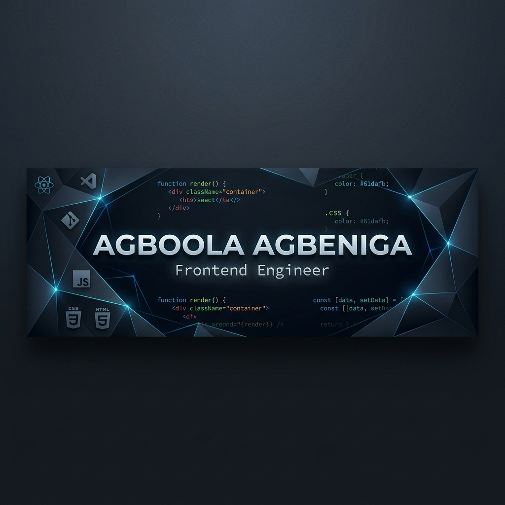

  

  

  
  

---

### 👨‍💻 About Me

I am a passionate **Frontend Engineer** with a unique background in **Civil Engineering**. I leverage my engineering problem-solving mindset to build high-performance, scalable, and visually stunning web and mobile applications.

With over **3 years of experience**, I specialize in creating seamless user experiences using modern technologies like **React, Next.js, and TypeScript**, with a growing focus on **AI Integration** and **Mobile Development**.

> 💼 **Open to Frontend & Full-Stack Engineering roles** — Remote or Hybrid preferred.

---

### 🛠️ Tech Stack & Tools

**Frontend**

**Mobile & Backend**

**AI & Tools**

---

### 🌟 Featured Projects

> 🤖 *This section is automatically synced from my pinned GitHub repositories daily.*

<!-- PROJECTS:START -->
| Project | Description | Tech Stack |
| :--- | :--- | :--- |
| **[Zuri Portfolio](https://zuriportfolio.vercel.app/)** · [Source](https://github.com/AgboolaAgbeniga/zuri-portfolio) | A marketplace for personalized portfolios and digital product sales. | Next.js, TypeScript, Tailwind |
| **[Dream Affairs](https://dream-affairs-frontend-dev.vercel.app)** · [Source](https://github.com/AgboolaAgbeniga/dream-affairs) | A sophisticated wedding planning web application. | Next.js, Shadcn UI, TypeScript |
| **[Movie Search Engine](https://movieapp-seven-cyan.vercel.app)** · [Source](https://github.com/AgboolaAgbeniga/movie-search) | AI-powered movie discovery using TMDb API. | React, Tailwind, TMDb API |
| **[Bus Fee Calculator](https://busfee-calculator.vercel.app/)** · [Source](https://github.com/AgboolaAgbeniga/busfee-calculator) | A utility app for calculating transportation costs. | Next.js, TypeScript, JSON |
<!-- PROJECTS:END -->

---

### 📊 GitHub Stats

  
  

  

  

  

---

### 🔭 Currently Working On
- 🤖 Integrating **AI and LLMs** into frontend workflows.
- 📱 Developing cross-platform mobile applications with **React Native**.
- ✍️ Writing technical articles on [Hashnode](https://wpgroom.hashnode.dev/).

### 📚 Currently Learning
- 🧠 LangChain & RAG Pipelines
- ☁️ AWS / Cloud Fundamentals
- 🧪 Automated Testing (Playwright, Vitest)

---

### 📫 Connect With Me

---

  <i>"Leveraging engineering precision to build the future of the web."</i>

